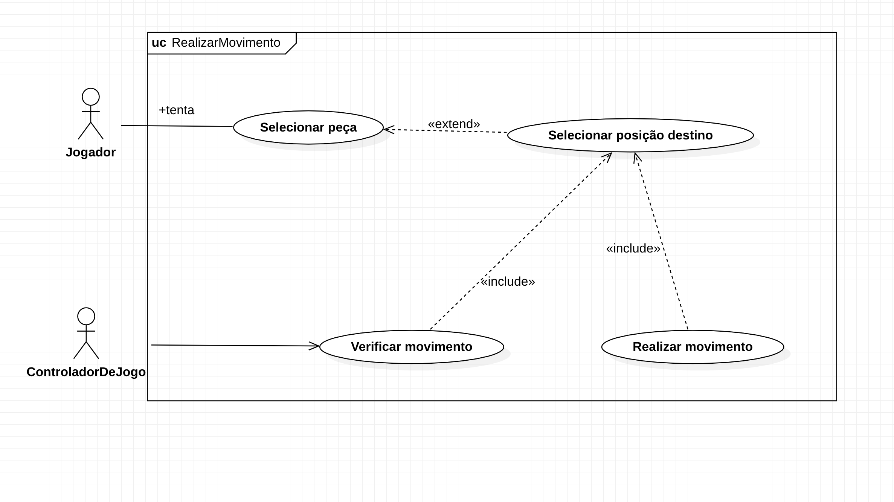
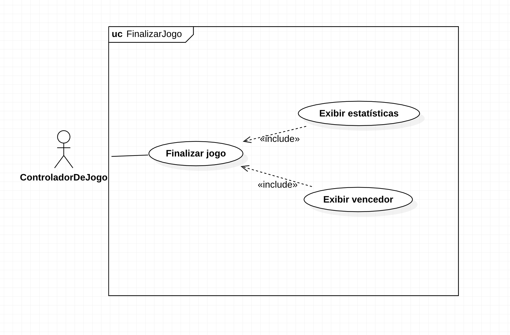
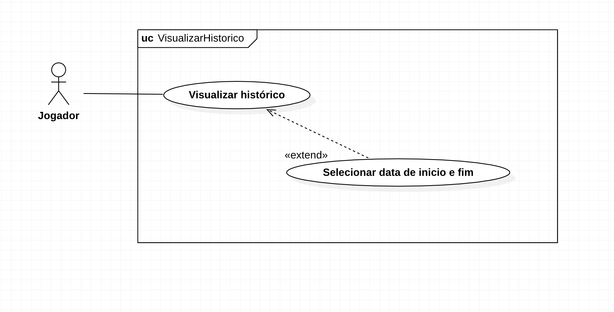
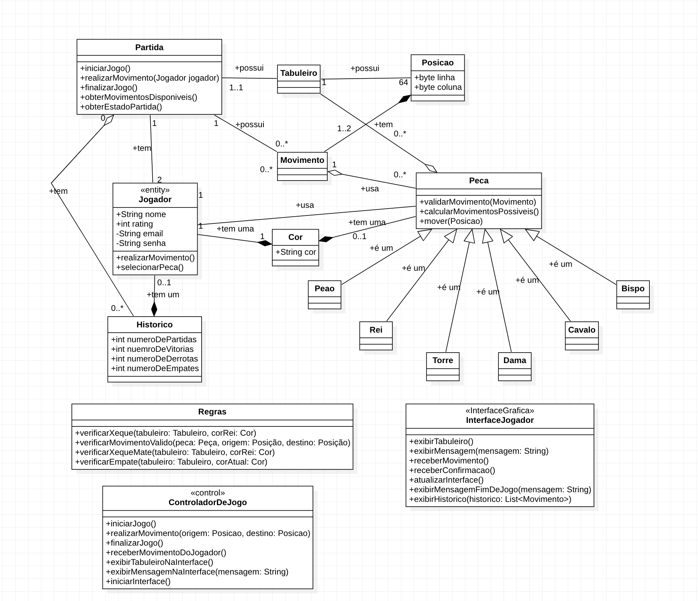
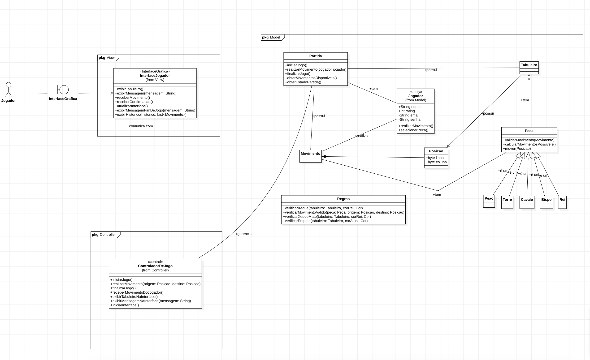

# INSTITUTO FEDERAL GOIANO - BACHARELADO EM CIENCIAS DA COMPUTAÇÃO
<figure>

  

---

 
  
Olá, seja bem-vindo ao meu repositório da disciplina de Prática de Laboratório de Pesquisa (Ambientação) do curso de Bacharelado em Ciência da Computação no Instituto Federal Goiano. Abaixo, você verá tudo o que foi feito e estudado neste curso.
  

 

  
Hello, welcome to my repository for the Laboratory Practice in Research (Orientation) course of the Bachelor's Degree in Computer Science at the Federal Institute of Goiano. Below, you will see everything that has been done and studied in this course.

# :rocket: Sobre / About

Princípios de modelagem software. Modelagem orientada a objetos. A linguagem UML.
Arquiteturas de software. Padrões de Projeto.

 

Software Modeling Principles. Object-Oriented Modeling. The UML Language.
Software Architectures. Design Patterns.

## Tecnologias / Technologies

 * [UML](https://www.uml.org/)
 * [LucidChart](https://www.lucidchart.com/pages/landing?utm_source=google&utm_medium=cpc&utm_campaign=_chart_en_tier3_mixed_search_brand_exact_&km_CPC_CampaignId=1484560207&km_CPC_AdGroupID=60168114191&km_CPC_Keyword=lucid%20chart&km_CPC_MatchType=e&km_CPC_ExtensionID=&km_CPC_Network=g&km_CPC_AdPosition=&km_CPC_Creative=442433234360&km_CPC_TargetID=kwd-55720648523&km_CPC_Country=9074194&km_CPC_Device=c&km_CPC_placement=&km_CPC_target=&gclid=CjwKCAjwyqWkBhBMEiwAp2yUFteZ_w0KOZx5uZf0htQWwvjuylzqI0efErItZk48JSvsASkBKrNrBBoChOkQAvD_BwE)
  * [Star UML]( https://staruml.io/)
  
  
# Colaboradores / Collaborators

  * [Aluno / Student (João Victor Rocha Vilela Godoi)](https://github.com/Joao-Victor-RVG)
  * [Aluno / Student (Pedro Paulo Soares Rabelo)](https://github.com/SwloBr)
  
  
  
## 🏫 Escola / School 

[IF-Goiano Website](https://ifgoiano.edu.br/home/index.php)

[YouTube Channel](https://www.youtube.com/user/ifgoiano)
  
  
  ---
  # :books: atividades acadêmicas / Academic Activities  UML 
  
  ### Caso de Uso

  
  
  
  

  
  ### Diagrama de Classe

  * Diagrama de Classe no padrão MVC / Class Diagram in the MVC Pattern

  
  ### Diagrama de Estado
  
  ### Diagrama de Sequência 
  
  ### Diagrama de Atividade 
  
  
  
  
  
  
  
  
  
  
  
  
  
  
  
  
  
  
  
  
  
  
  
  
  
  
  
  
  
  
 * [Slide apresentação final do jogo de Xadres e sua modelagem em UML  /  Final slide presentation of the Chess game and its modeling in UML](https://docs.google.com/presentation/d/1FbSgOG7UIUUrjjKw4PtNoJwyogETm0ft/edit?usp=sharing&ouid=108879520035228419943&rtpof=true&sd=true)
 
  
  
  
  
